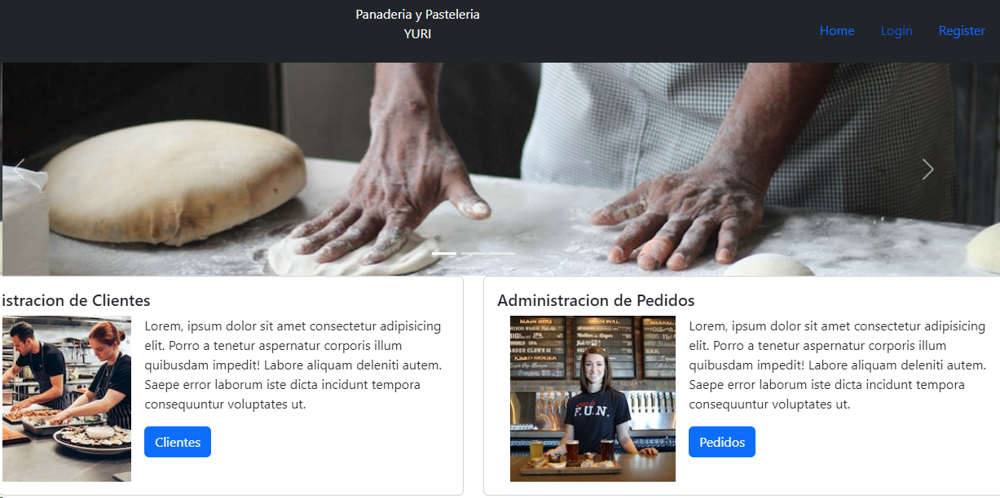
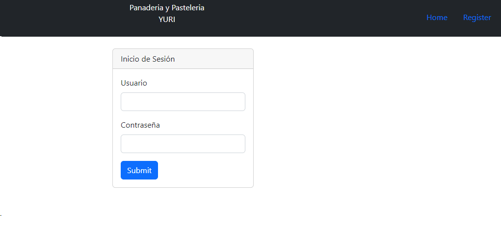
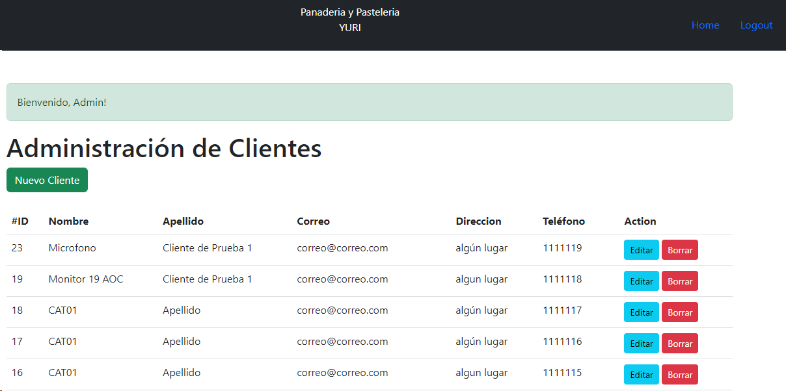
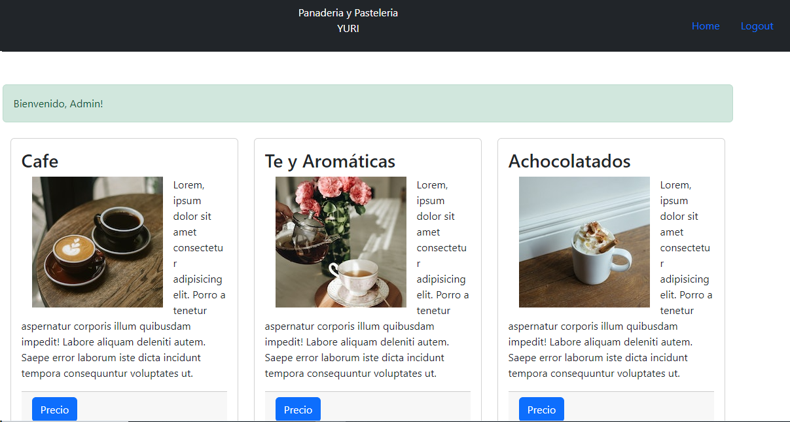

  

Rregistro de Clientes
Usando API´s y Rutas con Javascript, NodeJs, Express, MySql, HBS Render y Bootstrap

- Se ha implementado control de sesiones de usuario
- Encriptación de Passwords
- CRUD Basico de Clientes
- Catalogo de Imagenes  

Secciones:

+ Home Page
+ Login
+ Registro de usuarios
+ Administracion de Clientes
+ Pagina de Catalgogo de imagenes

----

| BackEnd | FrontEnd | Repositorio de Datos |
|-|-|-|
| Express  | Handlebars | MySQL |

---

Paqueteria Utilizada  

| Paquete | Versión |
|-|-| 
| bcryptjs | ^2.4.3 |
| dotenv | ^16.3.1 |
| express | ^4.18.2 |
| express-session | ^1.17.3 |
| hbs | ^4.2.0 |
| mysql | ^2.18.1 |
| nodemon | ^3.0.1 |

---

---

|Raúl Ibáñez M.|
|-------------------------|
